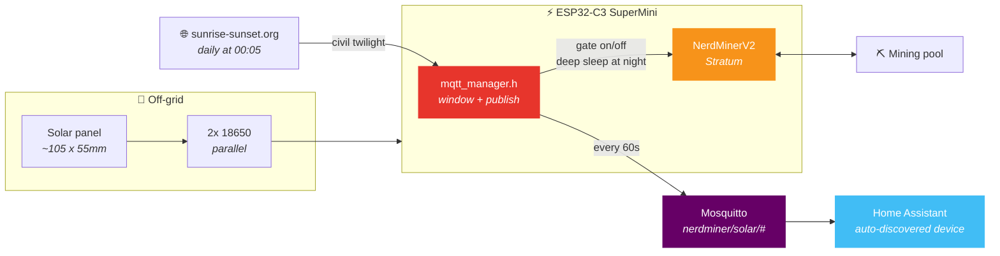

<div align="center">

# ☀️ Solar NerdMiner

**"Mine only while the sun is up — and tell Home Assistant all about it."**

[NerdMinerV2](https://github.com/BitMaker-hub/NerdMiner_v2) on an ESP32-C3 SuperMini, with
MQTT publishing, Home Assistant auto-discovery, and a mining window that follows civil
twilight for your location — fetched fresh every day.

[](#licence)
[](#hardware)
[](#how-to-build)
[](#mqtt-topics)
[](#home-assistant)
[](#hardware)
[](https://www.buymeacoffee.com/MrSossidge)

</div>

---

## The problem

A NerdMiner is a lottery ticket that draws a couple of watts. Run it off a small solar
panel and two 18650s, and those watts matter: mine through the night and you flatten the
pack before sunrise, so the miner is offline exactly when the panel starts producing again.

The fix isn't a timer — sunrise moves by two hours across a UK year, and the clocks change
twice. So the firmware asks
[sunrise-sunset.org](https://sunrise-sunset.org/api) for today's civil twilight times each
morning at 00:05 local, mines inside that window plus a configurable buffer, and idles
outside it.

While it's at it, it publishes everything it knows to MQTT, so the miner shows up in Home
Assistant as a proper device instead of a box you have to plug a screen into.

## What you get

| | |
|---|---|
| ⛏️ **Stratum mining** | Unmodified NerdMinerV2 hashing on an ESP32-C3 SuperMini. |
| 🌅 **Twilight scheduling** | Mines only between civil dawn and dusk for your coordinates, with a buffer either side (default 30 min). |
| 📅 **Refreshes daily** | New sunrise/sunset times fetched at 00:05 local, so the window tracks the season on its own. |
| ⏰ **Handles the clocks** | UK POSIX timezone string built in — GMT/BST transitions need no intervention. |
| 📡 **MQTT every 60s** | Hashrate, shares, uptime, totals, valid blocks and the current mining window. |
| 🏠 **Auto-discovery** | Sensors appear grouped under a **NerdMiner Solar** device. No `configuration.yaml` edits. |
| 😴 **Deep sleep at night** | Outside the mining window the ESP32 deep-sleeps rather than idling, to protect the battery pack through the dark hours. |
| 🌗 **Twilight vs window** | Raw civil twilight times are published alongside the buffered mining window, so you can see the difference the buffer makes. |
| 🔋 **Built for a battery** | Designed around 18650 cells charged by a panel salvaged from a solar wall light. |

## How it fits together



---

## Hardware

| Component | Details |
|---|---|
| Microcontroller | ESP32-C3 SuperMini |
| Power | 2× 18650 cells in parallel, charged from a small solar panel |
| Solar panel | Repurposed from a solar wall light (~105mm × 55mm) |
| Optional | BH1750 lux sensor + BME280 on a separate ESP32 for weather monitoring |

## Configuration

Everything lives at the top of `src/mqtt_manager.h`:

```cpp
// MQTT broker
#define MQTT_BROKER      "YOUR_MQTT_BROKER_IP"   // e.g. "192.168.1.50"
#define MQTT_PORT        1883
#define MQTT_USER        ""                       // leave blank if anonymous
#define MQTT_PASS        ""

// Your location (for sunrise/sunset calculation)
#define LOCATION_LAT     "YOUR_LATITUDE"          // e.g. "51.5074"
#define LOCATION_LNG     "YOUR_LONGITUDE"         // e.g. "-0.1278"

// Buffer added to the civil twilight window
#define TWILIGHT_BUFFER_SECS  1800     // 30 minutes either side

// How often to publish to MQTT
#define MQTT_INTERVAL_MS  60000UL      // 60 seconds
```

Twilight times refresh on a 24-hour timer (`SOLAR_REFRESH_MS`).

**Coordinates:** right-click your location in [Google Maps](https://maps.google.com) and copy
what appears at the top of the menu.

**Timezone:** the default is the UK string `GMT0BST,M3.5.0/1,M10.5.0`, which handles GMT/BST
by itself. Outside the UK, find yours in
[posix_tz_db](https://github.com/nayarsystems/posix_tz_db) and update `mqttTimeInit()`.

## How to build

1. Clone this repo
2. Open it in VS Code with the PlatformIO extension installed
3. Edit `src/mqtt_manager.h` with your broker and coordinates
4. Select the `ESP32-C3-super-mini` environment in the PlatformIO toolbar
5. Build, then Upload

## MQTT topics

Everything publishes under `nerdminer/solar/`:

| Topic | Description | Example |
|---|---|---|
| `status` | Retained liveness flag | `online` |
| `hashrate` | Current hash rate | `28.7 KH/s` |
| `shares` | Completed shares | `42` |
| `total_kh` | Total KH since boot | `4618735` |
| `uptime` | Uptime since boot | `0 05:17:08` |
| `valids` | Valid blocks found | `0` |
| `mining_active` | Currently mining? | `true` |
| `window_start` | Today's mining start | `03:46` |
| `window_end` | Today's mining end (twilight + buffer) | `22:09` |
| `twilight_start` | Today's raw civil dawn | `04:16` |
| `twilight_end` | Today's raw civil dusk | `21:39` |

**There is deliberately no Last Will and Testament.** The node deep-sleeps every night, so an
LWT would announce it dead each evening and alive each morning. `status` is published retained
as `online` instead, and absence of fresh data is the real liveness signal.

## Home Assistant

Nothing to configure. After first boot, go to **Settings → Devices & Services → MQTT** and the
**NerdMiner Solar** device is there — ten sensors grouped under one device (`ESP32-C3
SuperMini`, manufacturer `DIY`), each with its own icon.

## What changed from upstream NerdMinerV2

| File | Change |
|---|---|
| `src/mqtt_manager.h` | **New** — all MQTT and scheduling logic |
| `src/NerdMinerV2.ino.cpp` | Three includes plus hooks into `setup()` / `loop()` |
| `platformio.ini` | Added `knolleary/PubSubClient@^2.8` to the ESP32-C3-super-mini env |

`bblanchon/ArduinoJson` and `arduino-libraries/NTPClient` were already present upstream.

That's the whole diff — deliberately small, so pulling upstream fixes stays easy.

## Adapting for other locations

Two lines in `mqtt_manager.h`:

```cpp
#define LOCATION_LAT     "YOUR_LATITUDE"
#define LOCATION_LNG     "YOUR_LONGITUDE"
```

...and the timezone string in `mqttTimeInit()` if you're outside the UK.

## Licence

Based on [NerdMinerV2](https://github.com/BitMaker-hub/NerdMiner_v2) by BitMaker and
distributed under its terms. The additional MQTT and scheduling code here is released under
the MIT licence.

## Credits

- [BitMaker](https://github.com/BitMaker-hub) — the NerdMinerV2 project
- [sunrise-sunset.org](https://sunrise-sunset.org/api) — free sunrise/sunset API
- [knolleary/PubSubClient](https://github.com/knolleary/pubsubclient) — MQTT library

## Support

If this got your miner off mains and onto a panel, you can buy me a coffee.

<a href="https://www.buymeacoffee.com/MrSossidge"></a>
